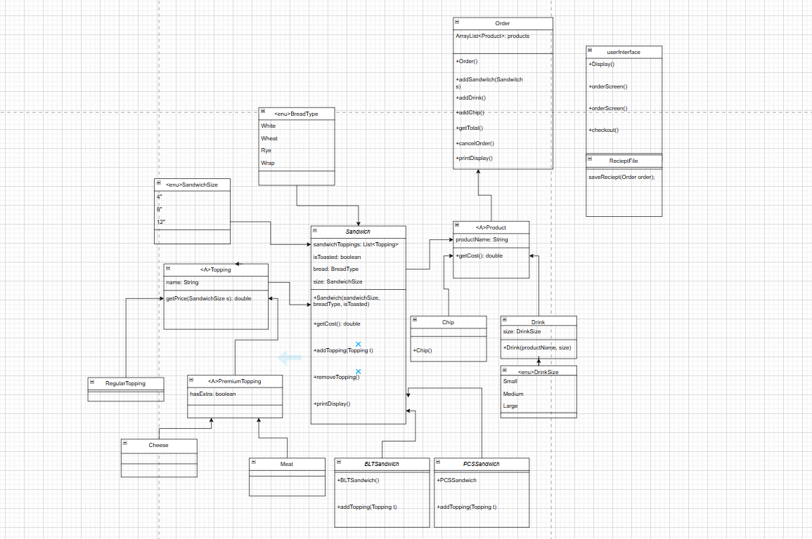
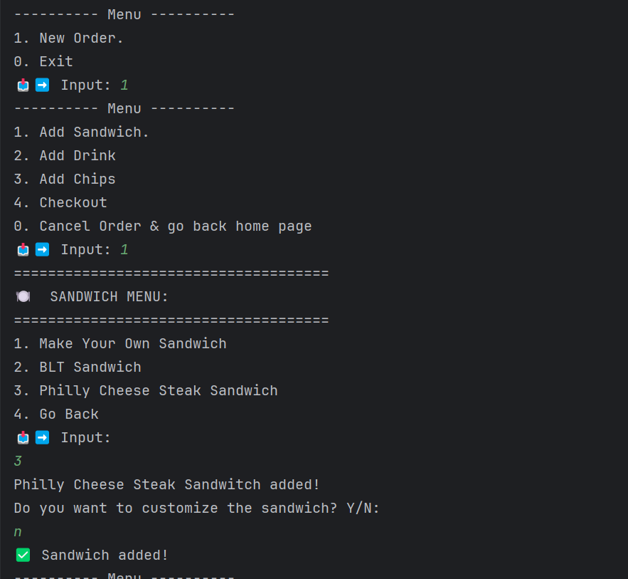
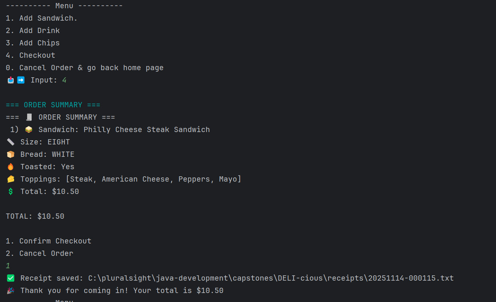

# DELI-cious

## Description of the Project

This console based java application is designed to allow the users to not only create their own sandwich through variety
of options but also select from pre-made signature sandwiches that it offers. Customers can choose to either 
add different toppings to their customize sandwiches or to the pre-made sandwiches from the Toppings menu. Customers can
also add sides to their order, chips and drinks. Once the user checkout, the app will display order summary and display
a receipt to the user that allows them to see their order details.

## User Stories

- As a user, I want to be able to choose the size of the bread so that I can buy a sandwich of my preference.
- As a user, I want to choose the type of bread so that I can choose bread that fits my taste.
- As a user, I want to have the option to either toast the sandwich or not so that I can the sandwich is made the way I want.
- As a user, I want to be able to choose regular topping so that I can customize my flavor of the sandwich.
- As a user, I want to have the option to add premium topping so that I can add to my sandwich extra flavor.
- As a user, I want to be able to remove topping so that I can remove any toppings I don't want.
- As a user, I want the sandwich cost to automatically update so that I can add/remove topping without having to calculate the cost myself.
- As a user, I want to be able to choose the size of my drink so that i can control the proportion.
- As a user, I want to be able to add chip so that I can have the option to add other product to my meal.
- As a user, I want a receipt after making a purchase so that I can get a record of everything I bought.

## Setup

After you have opened the folder with the instructions listed on "Running the application in intellij, scroll downed to
"app" class to run the application.
### Prerequisites

- IntelliJ IDEA: Ensure you have IntelliJ IDEA installed, which you can download from [here](https://www.jetbrains.com/idea/download/).
- Java SDK: Make sure Java SDK is installed and configured in IntelliJ.

### Running the Application in IntelliJ

Follow these steps to get your application running within IntelliJ IDEA:

1. Open IntelliJ IDEA.
2. Select "Open" and navigate to the directory where you cloned or downloaded the project.
3. After the project opens, wait for IntelliJ to index the files and set up the project.
4. Find the main class with the `public static void main(String[] args)` method.
5. Right-click on the file and select 'Run 'YourMainClassName.main()'' to start the application.

## Technologies Used

- Java: JDK 17
- Maven

## Demo

## Future Work

Outline potential future enhancements or functionalities you might consider adding:

- Make the app look more user-friendly
- add more try catch to handle errors.
- adding more features
- making the app more robust

## Resources

- [Potato Sense](https://chatgpt.com/g/g-681d378b0c90819197b16e49abe384ec-potato-sensei)
- [Youtube](https://youtube.com)

## Team Members

- Raymond - Project Manager.

## Thanks

Express gratitude towards those who provided help, guidance, or resources:

- Thank you to Raymond for continuous support and guidance.
- A special thanks to all teammates for their dedication and teamwork.
